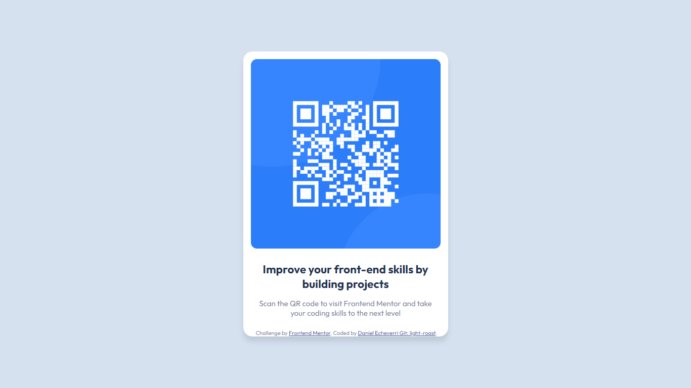

# Frontend Mentor - QR code component solution

This is a solution to the [QR code component challenge on Frontend Mentor](https://www.frontendmentor.io/challenges/qr-code-component-iux_sIO_H). Frontend Mentor challenges help you improve your coding skills by building realistic projects. 

## Table of contents

- [Overview](#overview)
  - [Screenshot](#screenshot)
  - [Links](#links)
- [My process](#my-process)
  - [Built with](#built-with)
  - [What I learned](#what-i-learned)
- [Author](#author)


## Overview

### Screenshot



### Links

- Solution URL: [https://github.com/light-roast/qr-code-component](https://github.com/light-roast/qr-code-component)
- Live Site URL: [https://qrcode-frontendmentor-lightroast.netlify.app/](https://qrcode-frontendmentor-lightroast.netlify.app/)

## My process

### Built with

- Semantic HTML5 markup
- CSS custom properties
- Flexbox

### What I learned

I lear how to position an element of a container at the bottom with this snippet of code:
```css
.container {
  position: relative;
  //Other style contents
}

.attribution {
    position: absolute;
    bottom: 0;
    
}


## Author

- Website - [Daniel Echeverri LLano](https://light-roast.github.io/portafolio/)
- Frontend Mentor - [@light-roast](https://www.frontendmentor.io/profile/light-roast)
- Twitter - [@echeverri_llano](https://www.twitter.com/echeverri_llano)

